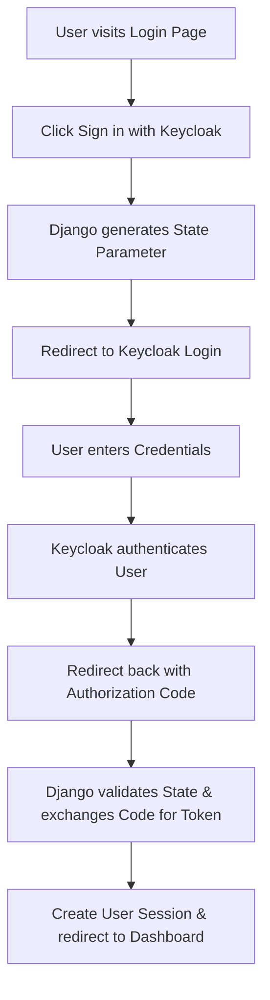

# 🔐 Complete Authentication Flow Explanation

> **Keycloak + Django OAuth2 Integration**
> Complete guide to how login works in your Django application

<style>
/* Enhanced Authentication Flow Styles */
.auth-flow-container {
    font-family: 'Segoe UI', Tahoma, Geneva, Verdana, sans-serif;
    line-height: 1.6;
    color: #2c3e50;
}

.step-details {
    background: linear-gradient(135deg, #f5f7fa 0%, #c3cfe2 100%);
    border-radius: 12px;
    padding: 20px;
    margin: 15px 0;
    border-left: 4px solid #3498db;
}

.parameter {
    background: rgba(255, 255, 255, 0.9);
    border-radius: 8px;
    padding: 15px;
    margin: 10px 0;
}

.parameter ul {
    margin: 10px 0;
    padding-left: 20px;
}

.parameter li {
    margin: 8px 0;
    background: #e8f4fd;
    padding: 8px 12px;
    border-radius: 6px;
    border-left: 3px solid #2196f3;
}

.flow-diagram {
    background: #f8f9fa;
    border-radius: 8px;
    padding: 15px;
    margin: 15px 0;
    text-align: center;
    font-family: 'Courier New', monospace;
}

.browser, .django, .keycloak {
    display: inline-block;
    background: linear-gradient(45deg, #667eea 0%, #764ba2 100%);
    color: white;
    padding: 10px 15px;
    border-radius: 8px;
    margin: 5px;
    font-weight: bold;
    min-width: 120px;
}

.arrow {
    font-size: 20px;
    color: #3498db;
    margin: 0 10px;
    font-weight: bold;
}

.keycloak-login {
    background: #2c3e50;
    color: white;
    border-radius: 12px;
    padding: 20px;
    margin: 20px 0;
}

.keycloak-login h4 {
    color: #3498db;
    text-align: center;
    margin-bottom: 15px;
}

.keycloak-login table {
    width: 100%;
    border-collapse: collapse;
}

.keycloak-login td {
    padding: 10px;
    border: 1px solid #34495e;
}

.keycloak-login button {
    background: #27ae60;
    color: white;
    border: none;
    padding: 10px 20px;
    border-radius: 6px;
    cursor: pointer;
    font-weight: bold;
}

.security-highlight {
    background: linear-gradient(135deg, #667eea 0%, #764ba2 100%);
    color: white;
    border-radius: 12px;
    padding: 20px;
    margin: 20px 0;
}

.security-highlight ul {
    list-style: none;
    padding: 0;
}

.security-highlight li {
    margin: 10px 0;
    padding-left: 25px;
    position: relative;
}

.security-highlight li:before {
    content: "✅";
    position: absolute;
    left: 0;
}

.api-request {
    background: #2c3e50;
    color: white;
    border-radius: 12px;
    padding: 20px;
    margin: 20px 0;
}

.api-request h5 {
    color: #3498db;
    margin-bottom: 10px;
}

.api-request pre {
    background: #1e272e;
    color: #f5f6fa;
    padding: 15px;
    border-radius: 8px;
    overflow-x: auto;
    font-family: 'Courier New', monospace;
    font-size: 12px;
}

.success-flow {
    background: linear-gradient(135deg, #11998e 0%, #38ef7d 100%);
    color: white;
    border-radius: 12px;
    padding: 20px;
    margin: 20px 0;
}

.success-flow h4 {
    text-align: center;
    margin-bottom: 20px;
}

.step {
    display: flex;
    align-items: center;
    margin: 15px 0;
}

.step .number {
    background: white;
    color: #27ae60;
    border-radius: 50%;
    width: 30px;
    height: 30px;
    display: flex;
    align-items: center;
    justify-content: center;
    font-weight: bold;
    margin-right: 15px;
}

.security-card {
    background: white;
    border-radius: 12px;
    padding: 20px;
    margin: 20px 0;
    border-left: 5px solid #e74c3c;
    box-shadow: 0 4px 6px rgba(0, 0, 0, 0.1);
}

.security-card h4 {
    color: #2c3e50;
    margin-bottom: 10px;
}

.security-card ul {
    list-style: none;
    padding: 0;
}

.security-card li:before {
    content: "✅";
    margin-right: 8px;
}

.auth-modes {
    display: grid;
    grid-template-columns: 1fr 1fr;
    gap: 20px;
    margin: 20px 0;
}

.mode-card {
    background: white;
    border-radius: 12px;
    padding: 20px;
    border-left: 5px solid #3498db;
    box-shadow: 0 4px 6px rgba(0, 0, 0, 0.1);
}

.mode-card h4 {
    color: #2c3e50;
    margin-bottom: 15px;
}

.code-block {
    background: #2c3e50;
    color: #ecf0f1;
    padding: 15px;
    border-radius: 8px;
    margin: 15px 0;
    font-family: 'Courier New', monospace;
    overflow-x: auto;
}

.mode-details ul {
    list-style: none;
    padding: 0;
}

.mode-details li {
    margin: 8px 0;
    padding: 8px;
    background: #f8f9fa;
    border-radius: 6px;
}

.token-section {
    background: white;
    border-radius: 12px;
    padding: 20px;
    margin: 20px 0;
    border: 2px solid #3498db;
}

.token-visual {
    margin: 20px 0;
}

.token-block {
    border-radius: 8px;
    overflow: hidden;
}

.token-header {
    background: linear-gradient(135deg, #667eea 0%, #764ba2 100%);
    color: white;
    padding: 15px;
    font-weight: bold;
    text-align: center;
}

.token-claims {
    margin: 20px 0;
}

.claims-grid {
    display: grid;
    grid-template-columns: repeat(auto-fit, minmax(300px, 1fr));
    gap: 15px;
    margin: 15px 0;
}

.claim-item {
    display: flex;
    justify-content: space-between;
    background: #f8f9fa;
    padding: 12px;
    border-radius: 8px;
    border-left: 4px solid #3498db;
}

.claim-name {
    font-weight: bold;
    color: #2c3e50;
    font-family: 'Courier New', monospace;
}

.error-section {
    background: #fff5f5;
    border-radius: 12px;
    padding: 20px;
    margin: 20px 0;
    border: 2px solid #fed7d7;
}

.error-cards {
    display: grid;
    grid-template-columns: repeat(auto-fit, minmax(400px, 1fr));
    gap: 20px;
    margin: 20px 0;
}

.error-card {
    background: white;
    border-radius: 12px;
    padding: 20px;
    border-left: 5px solid #e53e3e;
    box-shadow: 0 4px 6px rgba(0, 0, 0, 0.1);
}

.error-header {
    display: flex;
    align-items: center;
    margin-bottom: 15px;
}

.error-icon {
    font-size: 24px;
    margin-right: 10px;
}

.error-title {
    font-weight: bold;
    color: #2c3e50;
}

.error-cause {
    color: #e53e3e;
    margin: 10px 0;
}

.error-solution {
    color: #38a169;
    margin: 10px 0;
}

.error-details {
    background: #f7fafc;
    padding: 15px;
    border-radius: 8px;
    margin: 10px 0;
}

.troubleshooting-tips {
    background: linear-gradient(135deg, #ffecd2 0%, #fcb69f 100%);
    border-radius: 12px;
    padding: 20px;
    margin: 20px 0;
}

.troubleshooting-tips ul {
    list-style: none;
    padding: 0;
}

.troubleshooting-tips li {
    margin: 10px 0;
    padding: 10px;
    background: rgba(255, 255, 255, 0.8);
    border-radius: 8px;
}

.flow-summary {
    background: linear-gradient(135deg, #a8edea 0%, #fed6e3 100%);
    border-radius: 12px;
    padding: 20px;
    margin: 20px 0;
}

.flow-steps {
    margin: 20px 0;
}

.flow-step {
    display: flex;
    align-items: center;
    margin: 15px 0;
    background: rgba(255, 255, 255, 0.9);
    border-radius: 10px;
    padding: 15px;
    border-left: 4px solid #3498db;
}

.flow-step.success {
    border-left-color: #27ae60;
    background: rgba(39, 174, 96, 0.1);
}

.step-number {
    background: linear-gradient(135deg, #667eea 0%, #764ba2 100%);
    color: white;
    border-radius: 50%;
    width: 40px;
    height: 40px;
    display: flex;
    align-items: center;
    justify-content: center;
    font-weight: bold;
    margin-right: 20px;
    font-size: 18px;
}

.step-content {
    flex: 1;
}

.step-content strong {
    color: #2c3e50;
    display: block;
    margin-bottom: 5px;
}

.step-content p {
    margin: 0;
    color: #666;
}

.step-arrow {
    font-size: 24px;
    color: #3498db;
    margin-left: 20px;
}

.flow-timeline {
    display: grid;
    grid-template-columns: repeat(auto-fit, minmax(200px, 1fr));
    gap: 15px;
    margin: 20px 0;
}

.timeline-item {
    background: rgba(255, 255, 255, 0.9);
    border-radius: 8px;
    padding: 15px;
    text-align: center;
}

.time {
    font-weight: bold;
    color: #3498db;
    display: block;
    margin-bottom: 5px;
}

.event {
    color: #2c3e50;
    font-weight: bold;
    display: block;
    margin-bottom: 3px;
}

.detail {
    color: #666;
    font-size: 14px;
}

.flow-visualization {
    background: white;
    border-radius: 12px;
    padding: 20px;
    margin: 20px 0;
    border: 2px solid #3498db;
}

.flow-diagram-container {
    margin: 20px 0;
}

.diagram-phase {
    margin: 20px 0;
    padding: 20px;
    background: #f8f9fa;
    border-radius: 10px;
    border-left: 4px solid #3498db;
}

.phase-title {
    font-weight: bold;
    color: #2c3e50;
    text-align: center;
    margin-bottom: 15px;
    font-size: 18px;
}

.diagram-row {
    display: flex;
    align-items: center;
    justify-content: space-around;
    margin: 15px 0;
    flex-wrap: wrap;
}

.component {
    background: linear-gradient(45deg, #667eea 0%, #764ba2 100%);
    color: white;
    padding: 15px;
    border-radius: 10px;
    min-width: 120px;
    text-align: center;
    box-shadow: 0 4px 6px rgba(0, 0, 0, 0.1);
}

.comp-title {
    font-weight: bold;
    margin-bottom: 5px;
}

.comp-action {
    font-size: 12px;
    opacity: 0.9;
}

.arrow {
    font-size: 24px;
    color: #3498db;
    margin: 0 15px;
    font-weight: bold;
}

.diagram-connector {
    text-align: center;
    color: #666;
    font-weight: bold;
    margin: 20px 0;
    padding: 10px;
    background: rgba(52, 152, 219, 0.1);
    border-radius: 8px;
}

.flow-legend {
    background: #f8f9fa;
    border-radius: 10px;
    padding: 20px;
    margin: 20px 0;
}

.legend-items {
    display: grid;
    grid-template-columns: repeat(auto-fit, minmax(200px, 1fr));
    gap: 10px;
    margin: 15px 0;
}

.legend-item {
    display: flex;
    align-items: center;
    padding: 8px;
    background: white;
    border-radius: 6px;
}

.legend-symbol {
    margin-right: 10px;
    font-size: 16px;
}

.benefits-section {
    background: linear-gradient(135deg, #ffecd2 0%, #fcb69f 100%);
    border-radius: 12px;
    padding: 20px;
    margin: 20px 0;
}

.benefits-grid {
    display: grid;
    grid-template-columns: repeat(auto-fit, minmax(300px, 1fr));
    gap: 20px;
    margin: 20px 0;
}

.benefit-card {
    background: white;
    border-radius: 12px;
    padding: 20px;
    text-align: center;
    box-shadow: 0 4px 6px rgba(0, 0, 0, 0.1);
    transition: transform 0.2s;
}

.benefit-card:hover {
    transform: translateY(-5px);
}

.benefit-icon {
    font-size: 48px;
    margin-bottom: 15px;
}

.benefit-card h5 {
    color: #2c3e50;
    margin-bottom: 10px;
}

.benefit-card p {
    color: #666;
    margin: 0;
}

.conclusion {
    background: linear-gradient(135deg, #667eea 0%, #764ba2 100%);
    color: white;
    border-radius: 12px;
    padding: 30px;
    margin: 20px 0;
    text-align: center;
}

.conclusion h4 {
    margin-bottom: 20px;
    font-size: 24px;
}

.key-features {
    display: grid;
    grid-template-columns: repeat(auto-fit, minmax(250px, 1fr));
    gap: 15px;
    margin: 20px 0;
}

.feature-item {
    display: flex;
    align-items: center;
    background: rgba(255, 255, 255, 0.1);
    padding: 15px;
    border-radius: 8px;
}

.feature-check {
    margin-right: 10px;
    font-size: 18px;
}

/* Responsive Design */
@media (max-width: 768px) {
    .auth-modes, .error-cards, .benefits-grid {
        grid-template-columns: 1fr;
    }

    .diagram-row {
        flex-direction: column;
        align-items: center;
    }

    .arrow {
        transform: rotate(90deg);
        margin: 10px 0;
    }

    .flow-step {
        flex-direction: column;
        text-align: center;
    }

    .step-arrow {
        transform: rotate(90deg);
        margin: 10px 0;
    }
}
</style>

<div class="auth-flow-container">

## 📋 System Overview

The authentication system implements **OAuth 2.0 + OpenID Connect** with Keycloak as the identity provider. It provides **stateless user management** while maintaining sessions for web interface usability.

---

## 🔄 Complete Authentication Flow

### **Visual Overview**



---

## 📝 Step-by-Step Breakdown

### 🚪 **Step 1: User Initiates Login**

```bash
User visits: http://172.28.136.214:8010/login/
```

#### **What happens:**
1. Django renders login page with Keycloak button
2. User clicks "Sign in with Keycloak" (POST to `/login/`)
3. Django generates security parameters

<div class="step-details">
    <div class="parameter">
        <strong>🔒 Security Parameters Generated:</strong>
        <ul>
            <li><code>state</code>: Random string to prevent CSRF attacks</li>
            <li><code>client_id</code>: Application identifier ("easytask")</li>
            <li><code>response_type</code>: Authorization code flow</li>
            <li><code>scope</code>: User permissions requested (profile, email)</li>
            <li><code>redirect_uri</code>: Callback URL</li>
        </ul>
    </div>
</div>

```python
# Django app/views.py - login function
state = secrets.token_urlsafe(16)
request.session['oauth_state'] = state

auth_params = {
    'client_id': settings.KEYCLOAK_CLIENT_ID,        # 'easytask'
    'response_type': 'code',                         # Authorization code flow
    'scope': 'openid profile email',                  # What info we want
    'redirect_uri': 'http://172.28.136.214:8010/callback/',
    'state': state
}
```

### 🔄 **Step 2: Redirect to Keycloak**

```bash
Django redirects to:
http://172.28.136.214:8080/realms/teki_9/protocol/openid-connect/auth?
    client_id=easytask&
    response_type=code&
    scope=openid+profile+email&
    redirect_uri=http://172.28.136.214:8010/callback/&
    state=abc123...
```

<div class="flow-diagram">
    <div class="browser">🌐 Browser</div>
    <div class="arrow">→</div>
    <div class="django">🏛️ Django</div>
    <div class="arrow">→</div>
    <div class="keycloak">🔐 Keycloak</div>
</div>

**What happens:**
1. ✅ User redirected to Keycloak's login page
2. ✅ Keycloak validates client and parameters
3. ✅ Login form displayed to user

---

### 👤 **Step 3: User Authenticates with Keycloak**

```bash
User enters credentials in Keycloak:
- Username: [Keycloak username]
- Password: [Keycloak password]
```

<div class="keycloak-login">
    <h4>🔐 KEYCLOAK LOGIN PAGE</h4>
    <table>
        <tr><td>Username:</td><td>[user-input]</td></tr>
        <tr><td>Password:</td><td>[user-input]</td></tr>
        <tr><td><button>Sign In</button></td></tr>
    </table>
</div>

**What happens in Keycloak:**
- 🔍 **User Validation**: Checks credentials against Keycloak database
- 📱 **MFA Check**: If configured, prompts for additional verification
- ✅ **Consent Request**: Shows app permissions (profile, email access)
- 🎯 **Authorization**: User grants permission to application

---

### 📧 **Step 4: Keycloak Issues Authorization Code**

```bash
Keycloak redirects back to:
http://172.28.136.214:8010/callback/?
    code=abc123-def456-ghi789...&
    state=abc123...&
    session_state=jkl456...&
    iss=http://172.28.136.214:8080/realms/teki_9
```

<div class="security-highlight">
    <strong>🛡️ Security Features:</strong>
    <ul>
        <li>✅ <strong>State Verification</strong>: Same random string returned (CSRF protection)</li>
        <li>✅ <strong>Authorization Code</strong>: Temporary, single-use code</li>
        <li>✅ <strong>Secure Redirect</strong>: Direct server-to-server communication</li>
    </ul>
</div>

---

### ⚙️ **Step 5: Django Handles Callback**

```bash
Django receives request: /callback/
```

#### 🔍 **A. Security Validation**
```python
# Django app/views.py - callback function

# 1. Verify state parameter (CSRF protection)
state = request.GET.get('state')
stored_state = request.session.get('oauth_state')
if state != stored_state:
    return error_page("❌ Invalid state parameter - Possible CSRF attack")

# 2. Extract authorization code
code = request.GET.get('code')
if not code:
    return error_page("❌ No authorization code received")
```

#### 🔄 **B. Token Exchange**
```python
# 3. Exchange authorization code for access token
token_data = {
    'grant_type': 'authorization_code',
    'client_id': settings.KEYCLOAK_CLIENT_ID,     # 'easytask'
    'client_secret': settings.KEYCLOAK_CLIENT_SECRET,
    'code': code,
    'redirect_uri': 'http://172.28.136.214:8010/callback/'
}

token_url = f"{settings.KEYCLOAK_SERVER_URL}realms/{settings.KEYCLOAK_REALM}/protocol/openid-connect/token"
response = requests.post(token_url, data=token_data)
```

<div class="api-request">
    <h5>🌐 HTTP Request to Keycloak:</h5>
    <pre>POST http://172.28.136.214:8080/realms/teki_9/protocol/openid-connect/token
Content-Type: application/x-www-form-urlencoded

grant_type=authorization_code&
client_id=easytask&
client_secret=FxGBkGiByZVzoJzVJqLuAXezl0r3FpDa&
code=abc123-def456-ghi789...&
redirect_uri=http://172.28.136.214:8010/callback/</pre>

    <h5>📥 Keycloak Response:</h5>
    <pre>{
  "access_token": "eyJhbGciOiJSUzI1NiIs...",
  "token_type": "Bearer",
  "expires_in": 3600,
  "refresh_token": "optional-refresh-token",
  "id_token": "eyJhbGciOiJSUzI1NiIs...",
  "scope": "openid profile email"
}</pre>
</div>

#### 👤 **C. Token Storage and User Creation**
```python
# 4. Store access token in Django session
request.session['access_token'] = access_token

# 5. Decode JWT token (relaxed verification for web interface)
payload = jwt.decode(token, options={"verify_signature": False})
roles = payload.get("realm_access", {}).get("roles", [])
username = payload.get("preferred_username", "unknown")
email = payload.get("email", "")

# 6. Create in-memory user object (no database needed!)
request.user = KeycloakUser(username=username, email=email, roles=roles)
```

---

### 📊 **Step 6: Redirect to Dashboard**

```bash
User is redirected to: http://172.28.136.214:8010/dashboard/
```

<div class="success-flow">
    <h4>✅ Login Complete!</h4>
    <div class="step">
        <span class="number">1</span>
        <span class="text">Django middleware finds token in session</span>
    </div>
    <div class="step">
        <span class="number">2</span>
        <span class="text">Creates KeycloakUser object from JWT data</span>
    </div>
    <div class="step">
        <span class="number">3</span>
        <span class="text">Renders personalized dashboard</span>
    </div>
</div>

---

## 🛡️ Security Mechanisms

### 🔒 **1. State Parameter (CSRF Protection)**
<div class="security-card">
    <h4>Purpose</h4>
    <p>Prevents Cross-Site Request Forgery attacks</p>

    <h4>Implementation</h4>
    <ul>
        <li>✅ Random string generated by Django</li>
        <li>✅ Stored in Django session</li>
        <li>✅ Verified in callback (must match exactly)</li>
    </ul>

    <h4>Protection</h4>
    <p>❌ Attackers cannot forge valid state parameter</p>
</div>

### 🔄 **2. Authorization Code Flow**
<div class="security-card">
    <h4>Purpose</h4>
    <p>Prevents token interception attacks</p>

    <h4>Implementation</h4>
    <ul>
        <li>✅ Token never goes through browser URL</li>
        <li>✅ Direct server-to-server exchange</li>
        <li>✅ Single-use, short-lived code</li>
    </ul>

    <h4>Protection</h4>
    <p>❌ Man-in-the-middle attacks blocked</p>
</div>

### 🔑 **3. Client Secret**
<div class="security-card">
    <h4>Purpose</h4>
    <p>Proves client identity to Keycloak</p>

    <h4>Implementation</h4>
    <ul>
        <li>✅ Secret key known only to Django and Keycloak</li>
        <li>✅ Used in token exchange requests</li>
        <li>✅ Stored securely in Django settings</li>
    </ul>

    <h4>Protection</h4>
    <p>❌ Unauthorized clients cannot obtain tokens</p>
</div>

### 📄 **4. JWT Tokens**
<div class="security-card">
    <h4>Purpose</h4>
    <p>Stateless user authentication and authorization</p>

    <h4>Implementation</h4>
    <ul>
        <li>✅ Cryptographically signed by Keycloak</li>
        <li>✅ Contains user roles and permissions</li>
        <li>✅ Tamper-proof digital signature</li>
    </ul>

    <h4>Protection</h4>
    <p>❌ Tokens cannot be modified or forged</p>
</div>

## 🔄 Ongoing Authentication

<div class="auth-modes">
    <div class="mode-card">
        <h4>🌐 For Web Interface (Dashboard)</h4>
        <div class="code-block">
            <pre><code class="language-python"># middleware/checks each request
token = request.session.get('access_token')
if token:
    payload = jwt.decode(token, options={"verify_signature": False})
    request.user = KeycloakUser(...)</code></pre>
        </div>
        <div class="mode-details">
            <ul>
                <li>✅ <strong>Session-based</strong>: Uses Django session to store token</li>
                <li>✅ <strong>Relaxed verification</strong>: Trusts Keycloak signature</li>
                <li>✅ <strong>Fast</strong>: No cryptographic overhead</li>
                <li>✅ <strong>Seamless</strong>: User stays logged in across requests</li>
            </ul>
        </div>
    </div>

    <div class="mode-card">
        <h4>🔧 For API Calls</h4>
        <div class="code-block">
            <pre><code class="language-python"># Same middleware logic
if request.path.startswith('/api/'):
    # Check if API call came from web interface
    if request.session.get('access_token') == token:
        # Use relaxed verification for web interface calls
        payload = jwt.decode(token, options={"verify_signature": False})
    else:
        # Full verification for direct API calls
        payload = jwt.decode(token, public_key, algorithms=["RS256"], ...)</code></pre>
        </div>
        <div class="mode-details">
            <ul>
                <li>🔍 <strong>Smart Detection</strong>: Differentiates web vs direct API calls</li>
                <li>🛡️ <strong>Full Verification</strong>: JWT signature validation for external clients</li>
                <li>⚡ <strong>Hybrid Approach</strong>: Optimized for each use case</li>
                <li>🔄 <strong>Flexible</strong>: Supports both authenticated and public APIs</li>
            </ul>
        </div>
    </div>
</div>

## 📊 Token Content

<div class="token-section">
    <h4>🔑 JWT Token Structure</h4>
    <p>The JWT token contains rich user information and security claims:</p>

    <div class="token-visual">
        <div class="token-block">
            <div class="token-header">📄 Payload Data</div>
            <div class="code-block">
                <pre><code class="language-json">{
  "exp": 1732031800,                    // ⏰ Expiration time
  "iat": 1732031200,                    // 🕐 Issued at time
  "jti": "abc-123-def-456",             // 🆔 Token ID
  "iss": "http://172.28.136.214:8080/realms/teki_9",
  "aud": "easytask",                    // 🎯 Client ID
  "sub": "user-uuid-123",               // 👤 User ID
  "typ": "ID",                          // 📋 Token type
  "azp": "easytask",                    // 🔐 Authorized party
  "nonce": "random-string",             // 🎲 Security nonce
  "session_state": "jkl456...",          // 🔗 Session ID
  "acr": "1",                           // 📊 Authentication Context
  "realm_access": {
    "roles": ["admin", "user"]           // 👑 User roles
  },
  "resource_access": {},
  "scope": "openid profile email",      // 🎯 Granted scopes
  "sid": "session-id-123",              // 🔄 Session ID
  "email_verified": true,               // ✅ Email verified
  "name": "John Doe",                   // 👤 Full name
  "preferred_username": "johndoe",      // 🏷️ Username
  "given_name": "John",                 // 🎓 First name
  "family_name": "Doe",                 // 🏠 Last name
  "email": "john.doe@example.com"       // 📧 Email address
}</code></pre>
            </div>
        </div>
    </div>

    <div class="token-claims">
        <h5>🔍 Key Token Claims Explained:</h5>
        <div class="claims-grid">
            <div class="claim-item">
                <span class="claim-name">exp</span>
                <span class="claim-desc">⏰ Token expiration timestamp</span>
            </div>
            <div class="claim-item">
                <span class="claim-name">iat</span>
                <span class="claim-desc">🕐 Token issuance timestamp</span>
            </div>
            <div class="claim-item">
                <span class="claim-name">sub</span>
                <span class="claim-desc">👤 Unique user identifier</span>
            </div>
            <div class="claim-item">
                <span class="claim-name">realm_access</span>
                <span class="claim-desc">👑 User roles and permissions</span>
            </div>
            <div class="claim-item">
                <span class="claim-name">email</span>
                <span class="claim-desc">📧 User email address</span>
            </div>
            <div class="claim-item">
                <span class="claim-name">preferred_username</span>
                <span class="claim-desc">🏷️ Login username</span>
            </div>
        </div>
    </div>
</div>

## 🚨 Error Handling

<div class="error-section">
    <h4>⚠️ Common Errors and Solutions</h4>

    <div class="error-cards">
        <div class="error-card">
            <div class="error-header">
                <span class="error-icon">❌</span>
                <span class="error-title">"Invalid state parameter"</span>
            </div>
            <div class="error-content">
                <div class="error-cause">
                    <strong>🔍 Cause:</strong> Session lost or tampered
                </div>
                <div class="error-solution">
                    <strong>✅ Solution:</strong> Start login flow again
                </div>
                <div class="error-details">
                    <p>This happens when the Django session expires or when someone tries to forge a callback with a fake state parameter. It's actually a security feature working correctly!</p>
                </div>
            </div>
        </div>

        <div class="error-card">
            <div class="error-header">
                <span class="error-icon">🚫</span>
                <span class="error-title">"No authorization code received"</span>
            </div>
            <div class="error-content">
                <div class="error-cause">
                    <strong>🔍 Cause:</strong> Keycloak didn't issue code
                </div>
                <div class="error-solution">
                    <strong>✅ Solution:</strong> Check Keycloak configuration
                </div>
                <div class="error-details">
                    <p>Usually indicates a mismatch between the client configuration in Keycloak and the parameters sent from Django. Check client ID, redirect URI, and realm settings.</p>
                </div>
            </div>
        </div>

        <div class="error-card">
            <div class="error-header">
                <span class="error-icon">⚠️</span>
                <span class="error-title">"Token request failed with status 400"</span>
            </div>
            <div class="error-content">
                <div class="error-cause">
                    <strong>🔍 Cause:</strong> Client secret or redirect URI mismatch
                </div>
                <div class="error-solution">
                    <strong>✅ Solution:</strong> Verify Keycloak client settings
                </div>
                <div class="error-details">
                    <p>The most common issues are incorrect client secrets or redirect URIs that don't match exactly what's configured in Keycloak. Make sure the redirect URI in Django matches the one in Keycloak client settings.</p>
                </div>
            </div>
        </div>

        <div class="error-card">
            <div class="error-header">
                <span class="error-icon">🔓</span>
                <span class="error-title">"PKCE verification failed"</span>
            </div>
            <div class="error-content">
                <div class="error-cause">
                    <strong>🔍 Cause:</strong> PKCE code mismatch (disabled in this implementation)
                </div>
                <div class="error-solution">
                    <strong>✅ Solution:</strong> Use standard OAuth2 flow (current setup)
                </div>
                <div class="error-details">
                    <p>This implementation uses standard OAuth2 authorization code flow without PKCE for development simplicity. PKCE is typically used for public clients like mobile apps where client secrets can't be securely stored.</p>
                </div>
            </div>
        </div>
    </div>

    <div class="troubleshooting-tips">
        <h5>🔧 Quick Troubleshooting Tips:</h5>
        <ul>
            <li>📋 <strong>Check Logs:</strong> Always check Django console output for detailed error messages</li>
            <li>🌐 <strong>Verify URLs:</strong> Ensure all URLs (server, realm, redirect) match exactly</li>
            <li>🔄 <strong>Clear Session:</strong> Sometimes clearing browser cookies and Django sessions helps</li>
            <li>✅ <strong>Double-check Config:</strong> Verify client ID, secret, and realm in Keycloak admin console</li>
        </ul>
    </div>
</div>

## 🎯 Complete Flow Summary

<div class="flow-summary">
    <h4>🚀 Authentication Success Path</h4>

    <div class="flow-steps">
        <div class="flow-step">
            <div class="step-number">1</div>
            <div class="step-content">
                <strong>🖱️ User Initiates Login</strong>
                <p>Clicks "Sign in with Keycloak" button</p>
            </div>
            <div class="step-arrow">↓</div>
        </div>

        <div class="flow-step">
            <div class="step-number">2</div>
            <div class="step-content">
                <strong>🔐 Django Generates Security</strong>
                <p>Creates state parameter and prepares auth request</p>
            </div>
            <div class="step-arrow">↓</div>
        </div>

        <div class="flow-step">
            <div class="step-number">3</div>
            <div class="step-content">
                <strong>🌐 Redirect to Keycloak</strong>
                <p>User redirected to Keycloak login page</p>
            </div>
            <div class="step-arrow">↓</div>
        </div>

        <div class="flow-step">
            <div class="step-number">4</div>
            <div class="step-content">
                <strong>👤 User Authentication</strong>
                <p>Enters credentials in Keycloak interface</p>
            </div>
            <div class="step-arrow">↓</div>
        </div>

        <div class="flow-step">
            <div class="step-number">5</div>
            <div class="step-content">
                <strong>✅ Keycloak Validation</strong>
                <p>Credentials validated, consent obtained</p>
            </div>
            <div class="step-arrow">↓</div>
        </div>

        <div class="flow-step">
            <div class="step-number">6</div>
            <div class="step-content">
                <strong>🔗 Authorization Code</strong>
                <p>Keycloak redirects back with authorization code</p>
            </div>
            <div class="step-arrow">↓</div>
        </div>

        <div class="flow-step">
            <div class="step-number">7</div>
            <div class="step-content">
                <strong>🛡️ State Verification</strong>
                <p>Django validates state parameter (CSRF protection)</p>
            </div>
            <div class="step-arrow">↓</div>
        </div>

        <div class="flow-step">
            <div class="step-number">8</div>
            <div class="step-content">
                <strong>🔄 Token Exchange</strong>
                <p>Django exchanges code for access token</p>
            </div>
            <div class="step-arrow">↓</div>
        </div>

        <div class="flow-step">
            <div class="step-number">9</div>
            <div class="step-content">
                <strong>💾 Session Creation</strong>
                <p>Token stored in Django session</p>
            </div>
            <div class="step-arrow">↓</div>
        </div>

        <div class="flow-step">
            <div class="step-number">10</div>
            <div class="step-content">
                <strong>🏠 Dashboard Redirect</strong>
                <p>User redirected to dashboard</p>
            </div>
            <div class="step-arrow">↓</div>
        </div>

        <div class="flow-step">
            <div class="step-number">11</div>
            <div class="step-content">
                <strong>👤 User Object Creation</strong>
                <p>In-memory KeycloakUser created from JWT data</p>
            </div>
            <div class="step-arrow">↓</div>
        </div>

        <div class="flow-step success">
            <div class="step-number">12</div>
            <div class="step-content">
                <strong>🎉 Authentication Complete</strong>
                <p>Full access to dashboard and APIs</p>
            </div>
        </div>
    </div>

    <div class="flow-timeline">
        <div class="timeline-item">
            <span class="time">0-2s</span>
            <span class="event">🖱️ User Action</span>
            <span class="detail">Click and redirect</span>
        </div>
        <div class="timeline-item">
            <span class="time">2-10s</span>
            <span class="event">👤 User Input</span>
            <span class="detail">Credentials entry</span>
        </div>
        <div class="timeline-item">
            <span class="time">10-15s</span>
            <span class="event">🔄 Token Exchange</span>
            <span class="detail">Server communication</span>
        </div>
        <div class="timeline-item">
            <span class="time">15s+</span>
            <span class="event">🎉 Authenticated</span>
            <span class="detail">Full system access</span>
        </div>
    </div>
</div>

## 🔍 Flow Visualization

<div class="flow-visualization">
    <h4>🔄 System Interaction Diagram</h4>

    <div class="flow-diagram-container">
        <div class="flow-diagram">
            <!-- Phase 1: Login Initiation -->
            <div class="diagram-phase">
                <div class="phase-title">🚀 Phase 1: Login Initiation</div>
                <div class="diagram-row">
                    <div class="component browser">
                        <div class="comp-title">🌐 Browser</div>
                        <div class="comp-action">Click Login</div>
                    </div>
                    <div class="arrow">→</div>
                    <div class="component django">
                        <div class="comp-title">🏛️ Django</div>
                        <div class="comp-action">Generate State</div>
                    </div>
                    <div class="arrow">→</div>
                    <div class="component keycloak">
                        <div class="comp-title">🔐 Keycloak</div>
                        <div class="comp-action">Show Login Page</div>
                    </div>
                </div>
            </div>

            <div class="diagram-connector">↓ User enters credentials ↓</div>

            <!-- Phase 2: Authentication -->
            <div class="diagram-phase">
                <div class="phase-title">✅ Phase 2: Authentication</div>
                <div class="diagram-row">
                    <div class="component browser">
                        <div class="comp-title">🌐 Browser</div>
                        <div class="comp-action">Submit Form</div>
                    </div>
                    <div class="arrow">→</div>
                    <div class="component keycloak">
                        <div class="comp-title">🔐 Keycloak</div>
                        <div class="comp-action">Validate & Issue Code</div>
                    </div>
                    <div class="arrow">←</div>
                    <div class="component browser">
                        <div class="comp-title">🌐 Browser</div>
                        <div class="comp-action">Redirect with Code</div>
                    </div>
                </div>
            </div>

            <div class="diagram-connector">↓ Callback to Django ↓</div>

            <!-- Phase 3: Token Exchange -->
            <div class="diagram-phase">
                <div class="phase-title">🔄 Phase 3: Token Exchange</div>
                <div class="diagram-row">
                    <div class="component browser">
                        <div class="comp-title">🌐 Browser</div>
                        <div class="comp-action">Request Callback</div>
                    </div>
                    <div class="arrow">→</div>
                    <div class="component django">
                        <div class="comp-title">🏛️ Django</div>
                        <div class="comp-action">Verify State</div>
                    </div>
                </div>
                <div class="diagram-row">
                    <div class="component django">
                        <div class="comp-title">🏛️ Django</div>
                        <div class="comp-action">Exchange Code for Token</div>
                    </div>
                    <div class="arrow">↔</div>
                    <div class="component keycloak">
                        <div class="comp-title">🔐 Keycloak</div>
                        <div class="comp-action">Return Access Token</div>
                    </div>
                </div>
            </div>

            <div class="diagram-connector">↓ Session Created ↓</div>

            <!-- Phase 4: Dashboard Access -->
            <div class="diagram-phase">
                <div class="phase-title">🎉 Phase 4: Dashboard Access</div>
                <div class="diagram-row">
                    <div class="component django">
                        <div class="comp-title">🏛️ Django</div>
                        <div class="comp-action">Create User Object</div>
                    </div>
                    <div class="arrow">→</div>
                    <div class="component dashboard">
                        <div class="comp-title">📊 Dashboard</div>
                        <div class="comp-action">Render User Data</div>
                    </div>
                    <div class="arrow">←</div>
                    <div class="component browser">
                        <div class="comp-title">🌐 Browser</div>
                        <div class="comp-action">Display Dashboard</div>
                    </div>
                </div>
            </div>
        </div>
    </div>

    <div class="flow-legend">
        <h5>🔍 Component Legend:</h5>
        <div class="legend-items">
            <div class="legend-item">
                <span class="legend-symbol">🌐</span>
                <span class="legend-text">User Browser</span>
            </div>
            <div class="legend-item">
                <span class="legend-symbol">🏛️</span>
                <span class="legend-text">Django Application</span>
            </div>
            <div class="legend-item">
                <span class="legend-symbol">🔐</span>
                <span class="legend-text">Keycloak Server</span>
            </div>
            <div class="legend-item">
                <span class="legend-symbol">📊</span>
                <span class="legend-text">User Dashboard</span>
            </div>
            <div class="legend-item">
                <span class="legend-symbol">→</span>
                <span class="legend-text">Request/Response</span>
            </div>
            <div class="legend-item">
                <span class="legend-symbol">↔</span>
                <span class="legend-text">Bidirectional Exchange</span>
            </div>
        </div>
    </div>
</div>

## 🎉 Key Benefits of This Flow

<div class="benefits-section">
    <div class="benefits-grid">
        <div class="benefit-card">
            <div class="benefit-icon">🛡️</div>
            <h5>Enterprise Security</h5>
            <p>Uses industry-standard OAuth2 + OpenID Connect protocols with multiple layers of validation and protection</p>
        </div>

        <div class="benefit-card">
            <div class="benefit-icon">⚡</div>
            <h5>Stateless Architecture</h5>
            <p>No user database required in Django - complete user management handled by Keycloak</p>
        </div>

        <div class="benefit-card">
            <div class="benefit-icon">📈</div>
            <h5>Highly Scalable</h5>
            <p>Easy to add more applications without managing user credentials - centralized identity management</p>
        </div>

        <div class="benefit-card">
            <div class="benefit-icon">🔄</div>
            <h5>Multi-Platform Support</h5>
            <p>Works seamlessly with both web interfaces and API clients with smart authentication detection</p>
        </div>

        <div class="benefit-card">
            <div class="benefit-icon">🎯</div>
            <h5>Role-Based Access</h5>
            <p>Built-in support for fine-grained permissions and access control through Keycloak roles</p>
        </div>

        <div class="benefit-card">
            <div class="benefit-icon">🚀</div>
            <h5>Developer Friendly</h5>
            <p>Simple integration with comprehensive documentation and debugging tools</p>
        </div>
    </div>
</div>

---

<div class="conclusion">
    <h4>🎊 Authentication Flow Complete!</h4>
    <p>This authentication flow provides a complete, secure, and user-friendly login experience powered by Keycloak! 🚀</p>

    <div class="key-features">
        <div class="feature-item">
            <span class="feature-check">✅</span>
            <span>Zero database dependency for users</span>
        </div>
        <div class="feature-item">
            <span class="feature-check">✅</span>
            <span>Enterprise-grade security</span>
        </div>
        <div class="feature-item">
            <span class="feature-check">✅</span>
            <span>Session management for web usability</span>
        </div>
        <div class="feature-item">
            <span class="feature-check">✅</span>
            <span>API access with proper authentication</span>
        </div>
        <div class="feature-item">
            <span class="feature-check">✅</span>
            <span>Comprehensive error handling</span>
        </div>
        <div class="feature-item">
            <span class="feature-check">✅</span>
            <span>Role-based authorization</span>
        </div>
    </div>
</div>

</div> <!-- End auth-flow-container -->