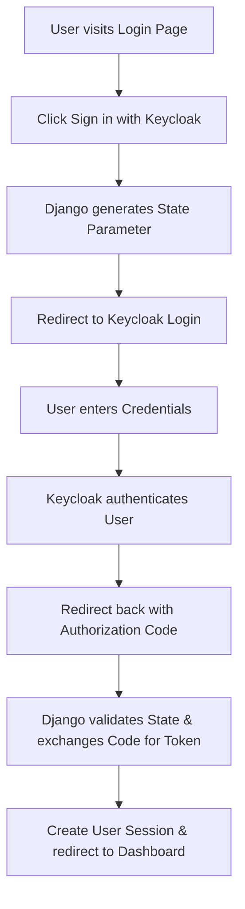

# 🔐 Complete Authentication Flow Explanation

> **Keycloak + Django OAuth2 Integration**
>
> Complete guide to how login works in your Django application

## 📋 System Overview

The authentication system implements **OAuth 2.0 + OpenID Connect** with Keycloak as the identity provider. It provides **stateless user management** while maintaining sessions for web interface usability.

---

## 🔄 Complete Authentication Flow

### **Visual Overview**



---

## 📝 Step-by-Step Breakdown

### 🚪 **Step 1: User Initiates Login**

```bash
User visits: http://172.28.136.214:8010/login/
```

**What happens:**
1. Django renders login page with Keycloak button
2. User clicks "Sign in with Keycloak" (POST to `/login/`)
3. Django generates security parameters

> **🔒 Security Parameters Generated:**
> * `state`: Random string to prevent CSRF attacks
> * `client_id`: Application identifier ("easytask")
> * `response_type`: Authorization code flow
> * `scope`: User permissions requested (profile, email)
> * `redirect_uri`: Callback URL

```python
# Django app/views.py - login function
state = secrets.token_urlsafe(16)
request.session['oauth_state'] = state

auth_params = {
    'client_id': settings.KEYCLOAK_CLIENT_ID,        # 'easytask'
    'response_type': 'code',                         # Authorization code flow
    'scope': 'openid profile email',                  # What info we want
    'redirect_uri': 'http://172.28.136.214:8010/callback/',
    'state': state
}
```

### 🔄 **Step 2: Redirect to Keycloak**

```bash
Django redirects to:
http://172.28.136.214:8080/realms/teki_9/protocol/openid-connect/auth?
    client_id=easytask&
    response_type=code&
    scope=openid+profile+email&
    redirect_uri=http://172.28.136.214:8010/callback/&
    state=abc123...
```

**What happens:**
1. ✅ User redirected to Keycloak's login page
2. ✅ Keycloak validates client and parameters
3. ✅ Login form displayed to user

---

### 👤 **Step 3: User Authenticates with Keycloak**

```bash
User enters credentials in Keycloak:
- Username: [Keycloak username]
- Password: [Keycloak password]
```

**What happens in Keycloak:**
- 🔍 **User Validation**: Checks credentials against Keycloak database
- 📱 **MFA Check**: If configured, prompts for additional verification
- ✅ **Consent Request**: Shows app permissions (profile, email access)
- 🎯 **Authorization**: User grants permission to application

---

### 📧 **Step 4: Keycloak Issues Authorization Code**

```bash
Keycloak redirects back to:
http://172.28.136.214:8010/callback/?
    code=abc123-def456-ghi789...&
    state=abc123...&
    session_state=jkl456...&
    iss=http://172.28.136.214:8080/realms/teki_9
```

> **🛡️ Security Features:**
> * ✅ **State Verification**: Same random string returned (CSRF protection)
> * ✅ **Authorization Code**: Temporary, single-use code
> * ✅ **Secure Redirect**: Direct server-to-server communication

---

### ⚙️ **Step 5: Django Handles Callback**

```bash
Django receives request: /callback/
```

#### 🔍 **A. Security Validation**

```python
# Django app/views.py - callback function

# 1. Verify state parameter (CSRF protection)
state = request.GET.get('state')
stored_state = request.session.get('oauth_state')
if state != stored_state:
    return error_page("❌ Invalid state parameter - Possible CSRF attack")

# 2. Extract authorization code
code = request.GET.get('code')
if not code:
    return error_page("❌ No authorization code received")
```

#### 🔄 **B. Token Exchange**

```python
# 3. Exchange authorization code for access token
token_data = {
    'grant_type': 'authorization_code',
    'client_id': settings.KEYCLOAK_CLIENT_ID,     # 'easytask'
    'client_secret': settings.KEYCLOAK_CLIENT_SECRET,
    'code': code,
    'redirect_uri': 'http://172.28.136.214:8010/callback/'
}

token_url = f"{settings.KEYCLOAK_SERVER_URL}realms/{settings.KEYCLOAK_REALM}/protocol/openid-connect/token"
response = requests.post(token_url, data=token_data)
```

#### 🌐 **HTTP Request to Keycloak:**

```http
POST http://172.28.136.214:8080/realms/teki_9/protocol/openid-connect/token
Content-Type: application/x-www-form-urlencoded

grant_type=authorization_code&
client_id=easytask&
client_secret=FxGBkGiByZVzoJzVJqLuAXezl0r3FpDa&
code=abc123-def456-ghi789...&
redirect_uri=http://172.28.136.214:8010/callback/
```

#### 📥 **Keycloak Response:**

```json
{
  "access_token": "eyJhbGciOiJSUzI1NiIs...",
  "token_type": "Bearer",
  "expires_in": 3600,
  "refresh_token": "optional-refresh-token",
  "id_token": "eyJhbGciOiJSUzI1NiIs...",
  "scope": "openid profile email"
}
```

#### 👤 **C. Token Storage and User Creation**

```python
# 4. Store access token in Django session
request.session['access_token'] = access_token

# 5. Decode JWT token (relaxed verification for web interface)
payload = jwt.decode(token, options={"verify_signature": False})
roles = payload.get("realm_access", {}).get("roles", [])
username = payload.get("preferred_username", "unknown")
email = payload.get("email", "")

# 6. Create in-memory user object (no database needed!)
request.user = KeycloakUser(username=username, email=email, roles=roles)
```

---

### 📊 **Step 6: Redirect to Dashboard**

```bash
User is redirected to: http://172.28.136.214:8010/dashboard/
```

> **✅ Login Complete!**
>
> 1. Django middleware finds token in session
> 2. Creates KeycloakUser object from JWT data
> 3. Renders personalized dashboard

---

## 🛡️ Security Mechanisms

### 🔒 **1. State Parameter (CSRF Protection)**

> **Purpose:** Prevents Cross-Site Request Forgery attacks
>
> **Implementation:**
> * ✅ Random string generated by Django
> * ✅ Stored in Django session
> * ✅ Verified in callback (must match exactly)
>
> **Protection:** ❌ Attackers cannot forge valid state parameter

### 🔄 **2. Authorization Code Flow**

> **Purpose:** Prevents token interception attacks
>
> **Implementation:**
> * ✅ Token never goes through browser URL
> * ✅ Direct server-to-server exchange
> * ✅ Single-use, short-lived code
>
> **Protection:** ❌ Man-in-the-middle attacks blocked

### 🔑 **3. Client Secret**

> **Purpose:** Proves client identity to Keycloak
>
> **Implementation:**
> * ✅ Secret key known only to Django and Keycloak
> * ✅ Used in token exchange requests
> * ✅ Stored securely in Django settings
>
> **Protection:** ❌ Unauthorized clients cannot obtain tokens

### 📄 **4. JWT Tokens**

> **Purpose:** Stateless user authentication and authorization
>
> **Implementation:**
> * ✅ Cryptographically signed by Keycloak
> * ✅ Contains user roles and permissions
> * ✅ Tamper-proof digital signature
>
> **Protection:** ❌ Tokens cannot be modified or forged

## 🔄 Ongoing Authentication

### 🌐 **For Web Interface (Dashboard)**

```python
# middleware/checks each request
token = request.session.get('access_token')
if token:
    payload = jwt.decode(token, options={"verify_signature": False})
    request.user = KeycloakUser(...)
```

* ✅ **Session-based**: Uses Django session to store token
* ✅ **Relaxed verification**: Trusts Keycloak signature
* ✅ **Fast**: No cryptographic overhead
* ✅ **Seamless**: User stays logged in across requests

### 🔧 **For API Calls**

```python
# Same middleware logic
if request.path.startswith('/api/'):
    # Check if API call came from web interface
    if request.session.get('access_token') == token:
        # Use relaxed verification for web interface calls
        payload = jwt.decode(token, options={"verify_signature": False})
    else:
        # Full verification for direct API calls
        payload = jwt.decode(token, public_key, algorithms=["RS256"], ...)
```

* 🔍 **Smart Detection**: Differentiates web vs direct API calls
* 🛡️ **Full Verification**: JWT signature validation for external clients
* ⚡ **Hybrid Approach**: Optimized for each use case
* 🔄 **Flexible**: Supports both authenticated and public APIs

## 📊 Token Content

### 🔑 **JWT Token Structure**

The JWT token contains rich user information and security claims:

```json
{
  "exp": 1732031800,                    // ⏰ Expiration time
  "iat": 1732031200,                    // 🕐 Issued at time
  "jti": "abc-123-def-456",             // 🆔 Token ID
  "iss": "http://172.28.136.214:8080/realms/teki_9",
  "aud": "easytask",                    // 🎯 Client ID
  "sub": "user-uuid-123",               // 👤 User ID
  "typ": "ID",                          // 📋 Token type
  "azp": "easytask",                    // 🔐 Authorized party
  "nonce": "random-string",             // 🎲 Security nonce
  "session_state": "jkl456...",          // 🔗 Session ID
  "acr": "1",                           // 📊 Authentication Context
  "realm_access": {
    "roles": ["admin", "user"]           // 👑 User roles
  },
  "resource_access": {},
  "scope": "openid profile email",      // 🎯 Granted scopes
  "sid": "session-id-123",              // 🔄 Session ID
  "email_verified": true,               // ✅ Email verified
  "name": "John Doe",                   // 👤 Full name
  "preferred_username": "johndoe",      // 🏷️ Username
  "given_name": "John",                 // 🎓 First name
  "family_name": "Doe",                 // 🏠 Last name
  "email": "john.doe@example.com"       // 📧 Email address
}
```

#### 🔍 **Key Token Claims Explained:**

| Claim | Description |
|-------|-------------|
| `exp` | ⏰ Token expiration timestamp |
| `iat` | 🕐 Token issuance timestamp |
| `sub` | 👤 Unique user identifier |
| `realm_access` | 👑 User roles and permissions |
| `email` | 📧 User email address |
| `preferred_username` | 🏷️ Login username |

## 🚨 Error Handling

### ⚠️ **Common Errors and Solutions**

#### ❌ **"Invalid state parameter"**

- **🔍 Cause:** Session lost or tampered
- **✅ Solution:** Start login flow again
- **📝 Details:** This happens when the Django session expires or when someone tries to forge a callback with a fake state parameter. It's actually a security feature working correctly!

#### 🚫 **"No authorization code received"**

- **🔍 Cause:** Keycloak didn't issue code
- **✅ Solution:** Check Keycloak configuration
- **📝 Details:** Usually indicates a mismatch between the client configuration in Keycloak and the parameters sent from Django. Check client ID, redirect URI, and realm settings.

#### ⚠️ **"Token request failed with status 400"**

- **🔍 Cause:** Client secret or redirect URI mismatch
- **✅ Solution:** Verify Keycloak client settings
- **📝 Details:** The most common issues are incorrect client secrets or redirect URIs that don't match exactly what's configured in Keycloak.

#### 🔓 **"PKCE verification failed"**

- **🔍 Cause:** PKCE code mismatch (disabled in this implementation)
- **✅ Solution:** Use standard OAuth2 flow (current setup)
- **📝 Details:** This implementation uses standard OAuth2 authorization code flow without PKCE for development simplicity.

### 🔧 **Quick Troubleshooting Tips:**

- 📋 **Check Logs:** Always check Django console output for detailed error messages
- 🌐 **Verify URLs:** Ensure all URLs (server, realm, redirect) match exactly
- 🔄 **Clear Session:** Sometimes clearing browser cookies and Django sessions helps
- ✅ **Double-check Config:** Verify client ID, secret, and realm in Keycloak admin console

## 🎯 Complete Flow Summary

### 🚀 **Authentication Success Path**

1. **🖱️ User Initiates Login** - Clicks "Sign in with Keycloak" button
2. **🔐 Django Generates Security** - Creates state parameter and prepares auth request
3. **🌐 Redirect to Keycloak** - User redirected to Keycloak login page
4. **👤 User Authentication** - Enters credentials in Keycloak interface
5. **✅ Keycloak Validation** - Credentials validated, consent obtained
6. **🔗 Authorization Code** - Keycloak redirects back with authorization code
7. **🛡️ State Verification** - Django validates state parameter (CSRF protection)
8. **🔄 Token Exchange** - Django exchanges code for access token
9. **💾 Session Creation** - Token stored in Django session
10. **🏠 Dashboard Redirect** - User redirected to dashboard
11. **👤 User Object Creation** - In-memory KeycloakUser created from JWT data
12. **🎉 Authentication Complete** - Full access to dashboard and APIs

### ⏱️ **Timeline Overview**

| Time | Event | Detail |
|------|-------|--------|
| 0-2s | 🖱️ User Action | Click and redirect |
| 2-10s | 👤 User Input | Credentials entry |
| 10-15s | 🔄 Token Exchange | Server communication |
| 15s+ | 🎉 Authenticated | Full system access |

## 🔍 Flow Visualization

### 🔄 **System Interaction Diagram**

#### **🚀 Phase 1: Login Initiation**
```
🌐 Browser → 🏛️ Django → 🔐 Keycloak
Click Login  Generate State  Show Login Page
```

**User enters credentials**

#### **✅ Phase 2: Authentication**
```
🌐 Browser → 🔐 Keycloak → 🌐 Browser
Submit Form  Validate & Issue Code  Redirect with Code
```

**Callback to Django**

#### **🔄 Phase 3: Token Exchange**
```
🌐 Browser → 🏛️ Django ↔ 🔐 Keycloak
Request Callback  Verify State  Return Access Token
                 Exchange Code for Token
```

**Session Created**

#### **🎉 Phase 4: Dashboard Access**
```
🏛️ Django → 📊 Dashboard ← 🌐 Browser
Create User Object  Render User Data  Display Dashboard
```

### 🔍 **Component Legend:**

| Symbol | Component |
|--------|-----------|
| 🌐 | User Browser |
| 🏛️ | Django Application |
| 🔐 | Keycloak Server |
| 📊 | User Dashboard |
| → | Request/Response |
| ↔ | Bidirectional Exchange |

## 🎉 Key Benefits of This Flow

| 🛡️ Enterprise Security | Uses industry-standard OAuth2 + OpenID Connect protocols with multiple layers of validation and protection |
| ⚡ Stateless Architecture | No user database required in Django - complete user management handled by Keycloak |
| 📈 Highly Scalable | Easy to add more applications without managing user credentials - centralized identity management |
| 🔄 Multi-Platform Support | Works seamlessly with both web interfaces and API clients with smart authentication detection |
| 🎯 Role-Based Access | Built-in support for fine-grained permissions and access control through Keycloak roles |
| 🚀 Developer Friendly | Simple integration with comprehensive documentation and debugging tools |

---

## 🎊 Authentication Flow Complete!

This authentication flow provides a complete, secure, and user-friendly login experience powered by Keycloak! 🚀

### ✅ **Key Features:**
- Zero database dependency for users
- Enterprise-grade security
- Session management for web usability
- API access with proper authentication
- Comprehensive error handling
- Role-based authorization